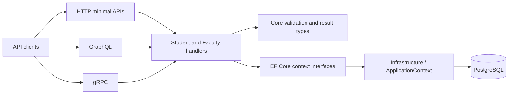

# AlumniService

**One set of alumni features, three API transports.**

AlumniService is an ASP.NET Core application for student and faculty records, employment, exams and further studies. HTTP, GraphQL and gRPC share domain handlers, validation and PostgreSQL persistence. Features are grouped into vertical slices so their requests, rules, mappings and database configuration stay close together.

[Explore the docs](docs/Home.md) · [Architecture](docs/Architecture.md) · [API guide](docs/API-Transports.md) · [Local development](docs/Local-Development.md)

## A tour of the system



The API hosts all three transports. Aspire starts the API, PostgreSQL and pgAdmin for local development. The record-view generator produces contract properties at compile time.

## Technology at a glance

| Area | Technology | Role |
|---|---|---|
| Runtime | .NET 10 / ASP.NET Core | API host and minimal HTTP endpoints |
| API contracts | HotChocolate / gRPC / OpenAPI | GraphQL, protobuf services and interactive API references |
| Domain flow | FluentValidation / OneOf | Request validation and explicit success/error results |
| Persistence | EF Core / Npgsql / PostgreSQL | Feature mappings, queries and migrations |
| Auth storage | ASP.NET Core Identity / OpenIddict | Account, invitation, session and token entities in the `Auth` schema |
| Local environment | .NET Aspire | Service orchestration |
| Build and tests | Cake.Sdk / xUnit v3 / Microsoft.Testing.Platform | Repeatable build, formatting and tests |
| Code generation | Roslyn incremental generator | `[RecordView]` partial records |

See [Technology Stack](docs/Technology-Stack.md) for package pins and implementation references. Auth persistence, shared permission policies, invitation provisioning and account activation are implemented. See [Invitations](docs/Invitations.md) for first-admin bootstrap and invitation acceptance. Login, token issuance and domain authorization enforcement are deferred; current domain endpoints do not require authorization.

Deferred auth work and new-session handoff are tracked in [Authentication and Authorization Roadmap](docs/Auth-Roadmap.md).

## Quick start

You need .NET SDK **10.0.401** (see [global.json](global.json)), a running Docker-compatible container runtime, and a trusted development HTTPS certificate.

Run from the repository root:

```sh
dotnet dev-certs https --trust
dotnet build.cs -- --target=Bootstrap
dotnet build.cs
```

Configure local PostgreSQL parameters through AppHost user secrets. Replace the placeholders with your own local values.

```sh
dotnet user-secrets set "Parameters:pg-user" "alumni-service" --file apphost.cs
dotnet user-secrets set "Parameters:pg-password" "<local-password>" --file apphost.cs
dotnet run --file apphost.cs
```

Open the dashboard login URL printed by Aspire (`https://localhost:18888`). Find the API and pgAdmin endpoints there. PostgreSQL binds host port `5432` and uses a persistent volume.

**Apply migrations before using database-backed endpoints.** Aspire does not apply them automatically. Follow [Persistence and Migrations](docs/Persistence-and-Migrations.md) to configure the API's connection and update the local database from a second terminal.

For direct API startup and troubleshooting, see [Local Development](docs/Local-Development.md).

## Try an API

| Transport | Entry point | Details |
|---|---|---|
| HTTP | `/student/`, `/faculty/`, `/company/`, `/exam/`, `/further-studies/` | 13 operations; student/faculty lists accept page parameters |
| GraphQL | `/graphql` | Queries and mutations over the same feature handlers |
| gRPC | Five `alumni.v1` services | Unary methods; HTTPS with HTTP/2 |
| API reference | `/swagger`, `/scalar`, `/openapi/v1.json` | Available in development |
| Health | `/healthz` | Includes PostgreSQL connectivity |

For example, send this query to `/graphql` using the API URL:

```graphql
query {
  students(pageNumber: 1, pageSize: 10) {
    items { studentId firstName lastName }
    totalCount
    hasNextPage
  }
}
```

The [API guide](docs/API-Transports.md) covers route parity, client types, pagination and transport-specific errors.

## Find your way around

```text
Source/
  Apps/
    Alumni.Api/       HTTP, GraphQL, gRPC and EF migrations
  Libraries/
    Alumni.Student/   Student, Company, Exam and FurtherStudy slices
    Alumni.Faculty/   Faculty slice
    Core/             Handlers, validation, value and result types
    Alumni.Auth/      Auth entities, roles, permission policies and EF configuration
    Infrastructure/   PostgreSQL context and registration
    Generators/       Record-view source generator
Tests/                Five isolated unit-test projects
docs/                 Wiki-style documentation
apphost.cs            File-based Aspire host
build.cs              Cake build targets
```

Start with [Architecture](docs/Architecture.md), follow a request in [Patterns and Request Lifecycle](docs/Patterns-and-Request-Lifecycle.md), then explore the [Data Model](docs/Domain-and-Data-Model.md) and [Source Generation](docs/Source-Generation.md).

## Build, test and contribute

```sh
dotnet build.cs -- --target=Test
dotnet build.cs -- --target=CI
```

`Test` builds and runs the solution tests. `CI` also verifies formatting, code style and analyzer diagnostics, then builds with warnings treated as errors. Unit tests cover Core, source generation, domain validation/mapping, HTTP registration/results, configuration and GraphQL. Successful persistence and database queries need separate integration checks.

See [Testing and CI](docs/Testing-and-CI.md) for suite-specific commands and coverage boundaries. Read [repository guidance](AGENTS.md) and scoped instructions before contributing. Keep package versions in [Directory.Packages.props](Directory.Packages.props), preserve unrelated changes, and keep secrets out of commits.
