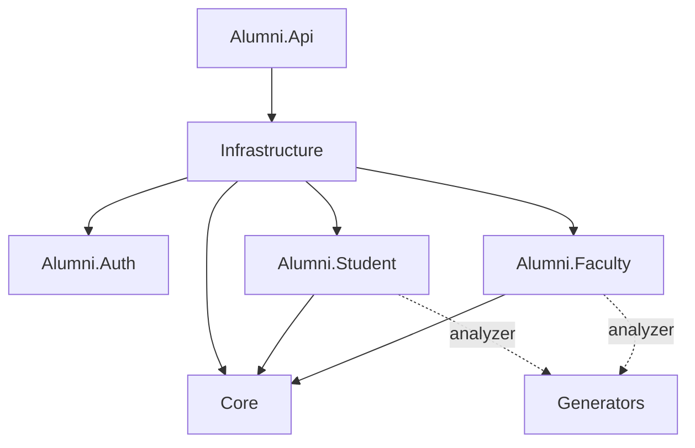
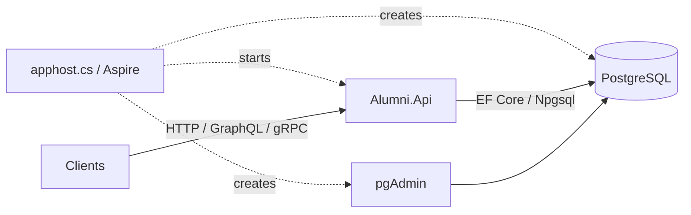

# Architecture

[Home](Home.md) · [Technology stack](Technology-Stack.md) · [Request lifecycle](Patterns-and-Request-Lifecycle.md)

AlumniService is a modular ASP.NET Core API organized into domain features. HTTP, GraphQL and gRPC adapters invoke the same Student and Faculty handlers; a shared EF Core context persists their data to PostgreSQL.

## Project boundaries

| Project | Responsibility |
| --- | --- |
| `Alumni.Api` | Startup, transport adapters, OpenAPI, settings and EF migrations |
| `Alumni.Student` | Student, company, exam and further-study use cases, validators, mapping and EF configuration |
| `Alumni.Faculty` | Faculty use cases, validators, mapping and EF configuration |
| `Core` | Handler execution, results, validation helpers, pagination, email value and record-view attribute |
| `Alumni.Auth` | Identity account/role entities, invitations, sessions and auth EF mappings |
| `Infrastructure` | PostgreSQL DbContext, independent domain/auth model composition and database health checks |
| `Generators` | Roslyn generator that produces record properties during compilation |

### Compile-time dependencies

Arrows below mean “references.” Solid arrows are ordinary project references; dotted arrows are analyzer references used during compilation.

The API references Infrastructure directly and receives the domain projects through transitive project references. See the [API project](../Source/Apps/Alumni.Api/Alumni.Api.csproj), [Infrastructure project](../Source/Libraries/Infrastructure/Infrastructure.csproj) and [Student project](../Source/Libraries/Alumni.Student/Alumni.Student.csproj).

## Runtime topology

The root [apphost.cs](../apphost.cs) is a file-based Aspire host. It creates PostgreSQL with a persistent volume, adds pgAdmin, and launches the API after PostgreSQL is ready. It supplies the `alumni-db` connection string to the API. It does not apply EF migrations.

## Composition and persistence

[Program.cs](../Source/Apps/Alumni.Api/Program.cs) is the composition root. It registers Infrastructure, OpenAPI, web API services, gRPC, GraphQL and logging, then maps the transport endpoints. GraphQL is active at `/graphql`.

[ApplicationContext](../Source/Libraries/Infrastructure/ApplicationContext.cs) extends `IdentityDbContext<AuthUser, AuthRole, string>` and implements both domain context interfaces. [Infrastructure registration](../Source/Libraries/Infrastructure/ConfigureServices.cs) exposes those interfaces as scoped adapters to the same underlying context within a scope. Identity base configuration is applied first, followed by feature-owned EF mappings. All auth tables use the `Auth` schema; migrations belong to the API assembly. Auth runtime services and authorization enforcement are deferred.

The domain libraries depend on EF Core and expose `DbSet` properties through their context interfaces. These boundaries organize implementation and make handler dependencies explicit; they do not remove persistence technology from the domain libraries.

## Transport boundaries

Classes named `*Controller` implement `IEndpoint` and map minimal API routes. [Endpoint.cs](../Source/Apps/Alumni.Api/Controllers/Endpoint.cs) explicitly registers each class. GraphQL resolvers and gRPC service methods create the same domain handlers and call `Execute`.

Each GraphQL resolver receives its own service scope, so parallel query fields do not share a DbContext. Each handler retains its own save boundary; multiple mutation fields are not one transaction. See [API transports](API-Transports.md) for contracts and error handling.

## Where to make a change

- Add domain behavior beside the relevant Student or Faculty use case.
- Add transport exposure in the API adapter and its explicit registration.
- Update Infrastructure when context composition or persistence registration changes.
- Update source models, generated views and handwritten mappers together when contract properties change.

Continue with [request patterns](Patterns-and-Request-Lifecycle.md), [persistence](Persistence-and-Migrations.md) or [source generation](Source-Generation.md).
