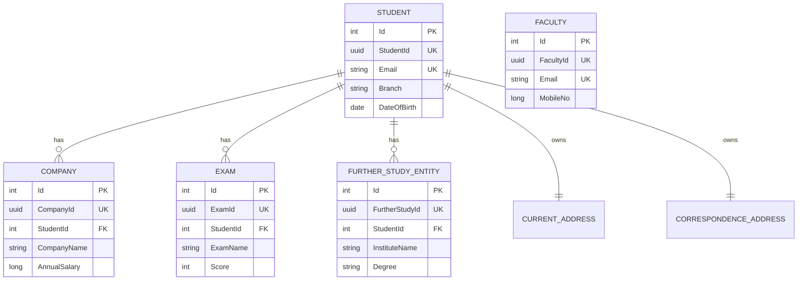

# Domain and data model

[Home](Home.md) · [Architecture](Architecture.md) · [Persistence and migrations](Persistence-and-Migrations.md)

AlumniService groups student profiles and their employment, exam and further-study records in `Alumni.Student`. Faculty records live in `Alumni.Faculty`. The domain libraries contain request records, validators, handlers, response mappers and EF configuration for their own features.

## Relationships at a glance

This conceptual diagram shows the domain relationships. Addresses share the student table; the address boxes do **not** represent separate database tables.

Each related-record handler first resolves the student's public GUID to the internal integer key. A missing student returns `NotFound`. Company creation sets the foreign key and navigation explicitly; exam and further-study creation add the new entity to the tracked student's collection. EF relationship tracking supplies their foreign keys when saving.

The committed [model snapshot](../Source/Apps/Alumni.Api/Migrations/ApplicationContextModelSnapshot.cs) defines required student foreign keys with cascade delete. There is currently no student-delete handler. Faculty has no mapped relationship to students or Identity users.

## Records, entities and identifiers

| Feature | Source model | Persisted type | Public identifier |
|---|---|---|---|
| Student | `Student` | `StudentEntity` | `StudentId` |
| Company | `Company` | `CompanyEntity` | `CompanyId` |
| Exam | `Exam` | `ExamEntity` | `ExamId` |
| Further study | `FurtherStudy` | `FurtherStudyEntity` | `FurtherStudyId` |
| Faculty | `Faculty` | `Faculty` | `FacultyId` |

Database `Id` values are generated integers. Public identifiers are GUIDs with unique indexes; clients use these identifiers for lookups. Student, company, exam and further-study creation generates version 7 GUIDs. Faculty creation uses `Guid.NewGuid()`. Creation requests generated from student-related models can expose public identifier properties, but handlers generate the persisted identifiers themselves.

`[RecordView]` copies selected model properties into partial request, response or entity records at compilation. Handwritten mappers still decide values and normalization. See [Source generation](Source-Generation.md).

Further study has an important persistence detail: configuration targets the base `FurtherStudy` record, while the context exposes `FurtherStudyEntity`. EF maps this inheritance to one `Student.further_studies` table with a `Discriminator` column. The derived type adds the student relationship; this is not a second table. See [FurtherStudy configuration](../Source/Libraries/Alumni.Student/FurtherStudy/FurtherStudyConfiguration.cs) and the snapshot.

## Validation and normalization

Callers invoke handlers through `Execute`, which validates before persistence. The shared rules are in [ValidationExtensions](../Source/Libraries/Core/ValidationExtensions.cs); each feature adds its own constraints.

New records trim surrounding whitespace from text. Names, addresses, branch and other free text retain casing, Unicode, punctuation and internal spaces. These creation policies do not rewrite existing rows.

| Input | Current policy |
|---|---|
| Student/faculty first and last names | Required; at most 100 trimmed characters each |
| Student/faculty email | Required; at most 100 trimmed characters for these records; normalized and syntax-validated by `Email` |
| Extension | Required text; at most 10 trimmed characters |
| Student mobile | 1–15 ASCII digits after trimming; cannot be all zeros; stored as a string |
| Faculty mobile | Positive `long`; the student string rule does not apply |
| Student branch | Required; at most 30 trimmed characters; no fixed allowed list |
| Student gender | Case-insensitive `Male` or `Female`; persists canonical casing |
| Student birth date | Age greater than 10 and no older than 100 relative to the current UTC date |
| Years | 1900 through the current UTC year |
| Student chronology | Admission cannot precede birth year; passing cannot precede admission |
| Student addresses | Both required; country, state, city and address line have 100-character trimmed limits; postal code is required free text |
| Company | Name ≤50, designation ≤30 trimmed characters; annual salary ≥0; valid joining year |
| Exam | Required name ≤100 trimmed characters; score 0–32767; valid year |
| Further study | Institute/degree ≤50, country/city ≤30 trimmed characters; passing year cannot precede admission |
| Lookup/related-record identifiers | Nonempty GUIDs |

### Email policy

The [Core `Email` value](../Source/Libraries/Core/Email.cs) trims whitespace and lowercases the whole address using invariant casing. Equality, conversions and display use that normalized value. Dots and plus aliases are preserved.

Syntax permits unquoted ASCII local parts with nonempty dot-separated segments and a dotted DNS domain. Domain labels permit letters, digits and internal hyphens, with at most 63 characters per label. The value allows up to 64 characters before `@` and 254 overall; student/faculty requests impose the smaller 100-character limit to match their columns. Punycode domains are accepted. Quoted local parts, raw Unicode addresses and IP literals are outside this policy. Syntax validation does not prove ownership or deliverability.

Student and faculty handlers check for an existing normalized email before insertion; each table also has a unique email index. The application does not require email uniqueness across both tables.

## Audit and deletion behavior

Student and faculty implement `IAuditableEntity` with `CreatedAt`, `UpdatedAt` and `IsDeleted`. Creation handlers set both timestamps to UTC. The model contains deletion flags, but the context has no global soft-delete filter or automatic audit interceptor. Faculty deletion calls `Remove` and physically deletes the row, returning the deleted record. Company, exam and further-study records do not carry these audit fields.

## Pagination

Student and faculty lists default to page 1 and size 10 at the domain input level. Validators require page ≥1, size 1–100, and an offset that fits in an integer. Those handlers order by internal `Id` before pagination.

Company and exam lists use fixed page 1, size 10; further-study lists use page 1, size 50. Their queries currently have no explicit sort order. These handlers first check that the student exists, so an existing student without related rows produces an empty page.

[PaginationQuery](../Source/Libraries/Core/PaginationQuery.cs) counts matching rows, then runs `Skip`/`Take`. [PaginatedList](../Source/Libraries/Core/PaginatedList.cs) exposes items, total count, page number, page size, total pages and previous/next-page flags. Mapping preserves this metadata. These are offset pages, with separate count and item queries.

## Source guide

- [Student model](../Source/Libraries/Alumni.Student/Student.cs), [entity](../Source/Libraries/Alumni.Student/StudentEntity.cs), [creation handler and mapper](../Source/Libraries/Alumni.Student/AddStudentHandler.cs)
- [Company slice](../Source/Libraries/Alumni.Student/Company/AddCompanyHandler.cs), [exam slice](../Source/Libraries/Alumni.Student/Exam/AddExamHandler.cs), [further-study slice](../Source/Libraries/Alumni.Student/FurtherStudy/AddFurtherStudyHandler.cs)
- [Faculty model](../Source/Libraries/Alumni.Faculty/Faculty.cs), [creation](../Source/Libraries/Alumni.Faculty/AddFacultyCommand.cs), [deletion](../Source/Libraries/Alumni.Faculty/DeleteFacultyHandler.cs)

---

Next: [Persistence and migrations](Persistence-and-Migrations.md) · [Home](Home.md)
