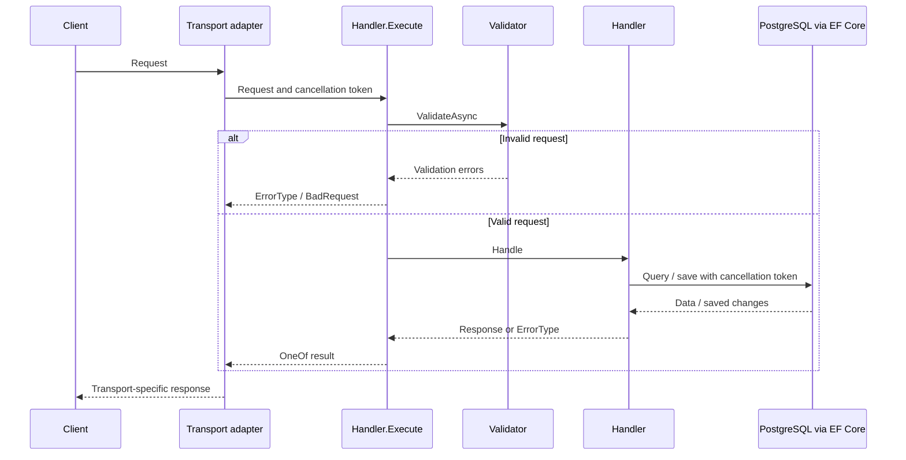

# Patterns and Request Lifecycle

[Home](Home.md) · [Architecture](Architecture.md) · [API transports](API-Transports.md)

Features are grouped around use cases. A slice commonly contains a request record, FluentValidation validator, handler and mapper; model and EF configuration files remain near the owning domain. [AddStudentHandler.cs](../Source/Libraries/Alumni.Student/AddStudentHandler.cs) is a complete write example.

## Direct handler execution

The [Core handler contract](../Source/Libraries/Core/Handler.cs) has two parts:

- `Validator` supplies an `AbstractValidator<TRequest>`.
- `Handle` performs the use case and returns `OneOf<TResponse, ErrorType>`.

Transport adapters instantiate a handler with its context and invoke the `Execute` extension. There is no mediator dispatch layer. Calling `Handle` directly bypasses the validation and exception handling in `Execute`.

`Execute` returns the first validation error as `BadRequest`, preserves handler-returned errors, and converts non-cancellation exceptions into an `ErrorType` whose default status is `InternalError`. `OperationCanceledException` propagates. Transport result adapters determine how those results become HTTP, GraphQL or gRPC responses.

## Write example: add a student

1. [StudentController](../Source/Apps/Alumni.Api/Controllers/StudentController.cs) binds the HTTP request, constructs `AddStudentHandler` and calls `Execute`.
2. The validator checks names, email, phone, gender, branch, birth date, year chronology and nested addresses before any persistence logic runs.
3. `Handle` normalizes the email and queries for an existing student. A match returns `Conflict`.
4. `ToStudent` creates a persistence entity with a new version-7 GUID, trims text, normalizes email and gender, and sets UTC audit timestamps. The client-supplied creation ID is not used as the persisted ID.
5. The handler adds the entity, calls `SaveChangesAsync`, and maps it to `StudentResponse`.
6. [ResultHelper](../Source/Apps/Alumni.Api/Controllers/ResultHelper.cs) returns HTTP 200 for success or converts `ErrorType` to an HTTP error result.

Each write handler owns its save boundary. The duplicate-email check is application behavior; it should not be interpreted as a guarantee against simultaneous competing requests without examining database constraints.

## Read example: list students

[GetAllStudentHandler](../Source/Libraries/Alumni.Student/GetAllStudentHandler.cs) validates pagination, orders by the internal `Id`, and invokes [Paginate](../Source/Libraries/Core/PaginationQuery.cs). That helper executes a count and then a `Skip`/`Take` query. `WithItems` maps entities to responses while preserving pagination metadata.

Pagination is offset-based. Ordering belongs to the caller; `Paginate` does not add ordering. Related-record handlers choose their own fixed page sizes, described in [API transports](API-Transports.md).

## Explicit mapping

Mappers are handwritten extension methods. They control normalization, generated identifiers, timestamps and response exposure. Generated record properties reduce repetitive declarations but do not generate mapping logic.

The [Email value](../Source/Libraries/Core/Email.cs) trims surrounding whitespace and lowercases the entire address using invariant casing. This is the application's email policy. Other text is trimmed while retaining casing and internal whitespace unless the use case explicitly canonicalizes it.

## Shared persistence interface

Handlers depend on [IStudentDbContext](../Source/Libraries/Alumni.Student/IStudentDbContext.cs) or [IFacultyDbContext](../Source/Libraries/Alumni.Faculty/IFacultyDbContext.cs). These interfaces expose EF `DbSet` queries and saving; there is no generic repository layer. [ApplicationContext](../Source/Libraries/Infrastructure/ApplicationContext.cs) implements both through `IApplicationContext`.

## Transport-specific results

| Adapter | Success | Handler failure |
| --- | --- | --- |
| HTTP minimal API | `Results.Ok` | Status-specific results, error body or problem details |
| GraphQL | Resolver value | GraphQL error with `extensions.code` |
| gRPC | Protobuf reply | gRPC status exception |

HTTP internal errors currently include the handler error message in problem details. GraphQL and gRPC internal errors use generic client-facing messages. Their shared handler contract does not imply identical wire behavior.

## Extending a slice

Start from the endpoint and trace validation, handler execution, mapping, persistence and result conversion. Keep new behavior in its owning domain, expose it through each required adapter, and review generated view properties alongside manual mappers. See [source generation](Source-Generation.md) and [testing](Testing-and-CI.md).
