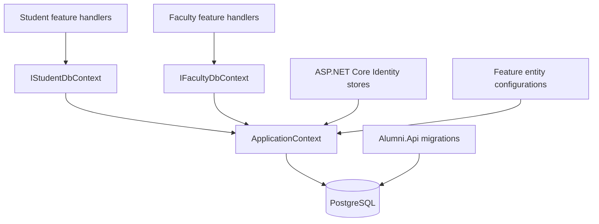

# Persistence and migrations

[Home](Home.md) · [Domain and data model](Domain-and-Data-Model.md) · [Local development](Local-Development.md)

AlumniService uses Entity Framework Core with the Npgsql PostgreSQL provider. One application context stores the domain records and ASP.NET Core Identity tables. Feature libraries own their EF configurations; the API project owns migrations.

## Context and dependency boundaries



[ApplicationContext](../Source/Libraries/Infrastructure/ApplicationContext.cs) derives from `IdentityDbContext<ApplicationUser>` and implements `IApplicationContext`, which combines [IStudentDbContext](../Source/Libraries/Alumni.Student/IStudentDbContext.cs) and [IFacultyDbContext](../Source/Libraries/Alumni.Faculty/IFacultyDbContext.cs). These interfaces expose feature `DbSet` properties and `SaveChangesAsync`; they are direct EF abstractions rather than repository interfaces.

[Infrastructure registration](../Source/Libraries/Infrastructure/ConfigureServices.cs) registers the context as scoped, then resolves both domain interfaces from that same scoped context. It selects PostgreSQL and `MigrationsAssembly("Alumni.Api")`. Each write handler calls `SaveChangesAsync` at its own save boundary. The context explicitly applies all five feature configurations and then Identity's base configuration. It does not override save methods for audit stamping or apply a global soft-delete filter.

## Schemas and mappings

| Database object | Mapping |
|---|---|
| `Student.students` | Generated integer primary key; unique student GUID and email; two owned addresses in the same table |
| `Student.companies` | Generated integer primary key; unique company GUID; required student foreign key |
| `Student.exams` | Generated integer primary key; unique exam GUID; exam-name index; required student foreign key |
| `Student.further_studies` | Base/derived further-study records share one table with a discriminator; unique public GUID; derived student foreign key (nullable table column for base rows) |
| `Faculty.faculties` | Generated integer primary key; unique faculty GUID and email |
| `AspNet*` tables | Identity users, roles, claims, logins, tokens and user-role links in the default schema |

Year fields and exam scores use PostgreSQL `SMALLINT`; salaries and faculty mobile numbers use `bigint`. Student mobile numbers and postal codes remain text. Birth dates use `date`, and audit timestamps use `timestamp with time zone`. Current student/faculty configuration requires `UpdatedAt` in the database even though the CLR property is nullable.

The [committed snapshot](../Source/Apps/Alumni.Api/Migrations/ApplicationContextModelSnapshot.cs) records cascade deletion for student-related entities. `CurrentAddress` and `CorrespondenceAddress` are required owned navigations, stored as prefixed columns on `Student.students`. Further study uses table-per-hierarchy inheritance: the relationship is required for `FurtherStudyEntity`, but the physical `StudentId` column is nullable to accommodate base-type rows. Consult the snapshot and [initial migration](../Source/Apps/Alumni.Api/Migrations/20261003093524_InitialCreate.cs) when reviewing generated schema changes.

## Connection configuration

[SettingService](../Source/Apps/Alumni.Api/Services/SettingService.cs) first reads `ConnectionStrings:alumni-db`; Aspire supplies this complete connection string. Direct execution can supply it through `ConnectionStrings__alumni-db`.

For EF commands launched from a separate terminal, Aspire does not inject the connection string into that process. Set it explicitly in that terminal, using the local database values:

```sh
export ConnectionStrings__alumni-db='Host=localhost;Port=5432;Database=alumni-db;Username=<local-user>;Password=<local-password>'
export Authentication__Secret='<local-signing-secret>'
export Authentication__ValidAudience='<local-audience>'
export Authentication__ValidIssuer='<local-issuer>'
```

If that value is blank, the service formats `Database:Connection`, substituting its `{0}` placeholder with `Database:Password` when its configured `Environment` is `Development`, or `DATABASE_PASSWORD` otherwise. That `Environment` configuration key defaults to `Development`. Authentication settings are also required when startup constructs infrastructure services; see [Local development](Local-Development.md).

Keep database credentials and JWT secrets in local secret storage or environment configuration. Use local placeholder values when sharing command output; do not publish the dashboard's credential-bearing connection string.

## Create a migration

Run from the repository root. Configure the API's database and authentication settings first; the EF startup project builds the API's service configuration.

Restore the repository tool and generate the migration:

```sh
dotnet tool restore
dotnet ef migrations add AddStudentField --project Source/Apps/Alumni.Api --startup-project Source/Apps/Alumni.Api -- --environment Development
```

Replace `AddStudentField` with a descriptive migration name. The equivalent [Cake target](../build.cs) uses those same project paths and environment arguments:

```sh
dotnet build.cs -- --target=Add-Migration --MigrationName=AddStudentField
```

Migration generation writes source files and updates the model snapshot; it does not apply changes to a database. Keep one owner for generation and serialize builds and EF commands in a shared checkout.

Before accepting the generated migration:

1. Check `Up` and `Down`, table/schema names, nullability, indexes and foreign keys.
2. Compare the snapshot with the intended model change, especially generated record properties and further-study inheritance.
3. Review destructive operations and the treatment of existing rows when adding required columns.
4. Build and run the relevant checks described in [Testing and CI](Testing-and-CI.md).

## Apply migrations manually

AppHost and API startup do not automatically apply migrations. Once PostgreSQL is running and the API points to the intended local database, apply them explicitly:

```sh
dotnet ef database update --project Source/Apps/Alumni.Api --startup-project Source/Apps/Alumni.Api -- --environment Development
```

For the Aspire database, PostgreSQL binds host port `5432`. Its persistent volume retains data between starts; changing credentials does not recreate or migrate that database. Apply the schema before using endpoints that need tables. `/healthz` includes a PostgreSQL check; inspect configuration and database availability when diagnosing unhealthy results.

## Source guide

- [Student configuration](../Source/Libraries/Alumni.Student/StudentConfiguration.cs)
- [Company configuration](../Source/Libraries/Alumni.Student/Company/CompanyConfiguration.cs), [exam configuration](../Source/Libraries/Alumni.Student/Exam/ExamConfiguration.cs), [further-study configuration](../Source/Libraries/Alumni.Student/FurtherStudy/FurtherStudyConfiguration.cs)
- [Faculty configuration](../Source/Libraries/Alumni.Faculty/FacultyConfiguration.cs)
- [Application user](../Source/Libraries/Infrastructure/Identity/ApplicationUser.cs) and [database health check](../Source/Libraries/Infrastructure/HealthCheck.cs)

---

Next: [Local development](Local-Development.md) · [Home](Home.md)
