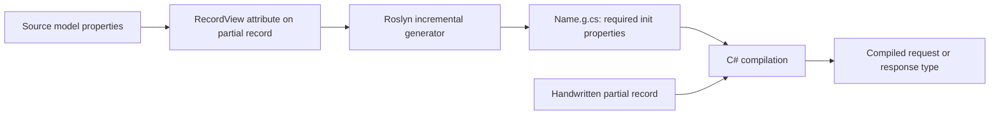

# Source Generation

[Home](Home.md) · [Request patterns](Patterns-and-Request-Lifecycle.md) · [Technology stack](Technology-Stack.md)

`[RecordView]` creates properties for request and response records during compilation. This is why a small or empty partial record can still expose a complete contract.

## How record views are built



[Core/RecordView.cs](../Source/Libraries/Core/RecordView.cs) defines the source type and optional excluded property names. [RecordViewGenerator](../Source/Libraries/Generators/RecordViewGenerator.cs) discovers that attribute by its fully qualified name, reads the source symbol and emits a partial record in the target's namespace.

Both domain projects reference Generators as an analyzer using `OutputItemType="Analyzer"` and `ReferenceOutputAssembly="false"`. The generator targets `netstandard2.0`; application projects target `net10.0`. It is build tooling, not a runtime service.

## Student example

[Student](../Source/Libraries/Alumni.Student/Student.cs) declares the source properties. [AddStudent](../Source/Libraries/Alumni.Student/AddStudentHandler.cs) and [StudentResponse](../Source/Libraries/Alumni.Student/StudentResponse.cs) both select all of those properties:

```csharp
[RecordView(typeof(Student))]
public sealed partial record AddStudent
{
}
```

The generator contributes declarations such as:

```csharp
public required global::System.Guid StudentId { get; init; }
public required string FirstName { get; init; }
```

This is a shared property shape, not inheritance from `Student`. `AddStudent` currently includes `StudentId` because it is not excluded; its mapper still generates the persisted ID itself.

## Excluding properties

[FacultyResponse](../Source/Libraries/Alumni.Faculty/FacultyResponse.cs) omits the internal database identifier and deletion flag:

```csharp
[RecordView(typeof(Faculty), nameof(Faculty.Id), nameof(Faculty.IsDeleted))]
public sealed partial record FacultyResponse
{
}
```

Exclusions compare property names. Keep them explicit and review exposure when the source model gains a property.

## Current generator behavior

- It selects public properties returned by the source symbol's `GetMembers`; it does not walk base types or copy fields.
- It emits every selected property as `required` with an `init` accessor, regardless of the source property's accessor style.
- It uses fully qualified type names and preserves nullable reference annotations.
- It emits the target namespace and a `public partial record` declaration.
- It names generated sources `<TargetName>.g.cs`; maintain unique target names when adding views in one compilation.

Required properties enforce initialization in ordinary C# construction. They do not replace FluentValidation, transport input validation or database constraints.

## What remains handwritten

The generator does not create validators, mappers, handlers, EF mappings or transport adapters. [StudentResponseMapper](../Source/Libraries/Alumni.Student/StudentResponse.cs) explicitly selects values, while [AddStudentMapper](../Source/Libraries/Alumni.Student/AddStudentHandler.cs) performs normalization and creates persistence metadata.

When changing a source model:

1. Find all views that reference it and check whether each should expose the new property.
2. Review exclusions and required initialization in every mapper.
3. Review validators, EF configuration and each transport contract.
4. Build the consuming projects to check generated code and handwritten code together.

Edit source models or the generator rather than generated artifacts under `obj/`. [Generator tests](../Tests/Generators.UnitTests/RecordViewGeneratorTests.cs) compile sample inputs with Roslyn and check generated properties and diagnostics. See [testing and CI](Testing-and-CI.md) for verification commands.
